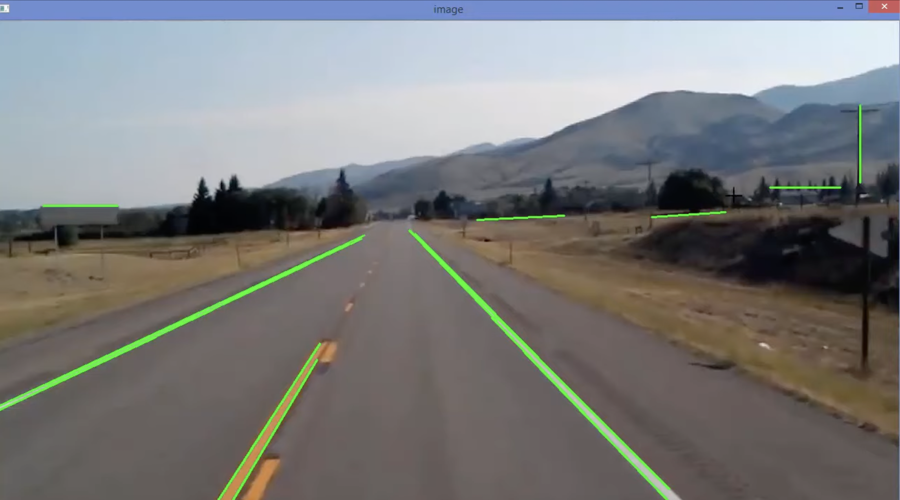

# Road Detection Articulation -------> Roadify

Image Processing project developed to assist drivers using camera data, the designed software led to a decrease in time and space complexities of the conventional
methods to the same approach.

# About the Problem Statement

Today Road Accidents are a major cause of deaths .The main reason for Road accidents is over speeding and getting lost of lanes thus leading accidents ,forms one of
the main causes of impermanence, also have an economic impact of the owners of vehicles.Most of the automotive industries are developing technology to reduce risk
in vehicles. In this way, lane detection systems is important, because from this data is possible to determine risk situations hence reducing accidents. Here we
propose a technique for lane detection, based on image processing, which allows identifying the position of lateral or partial lanes. The idea is based on
converting the given image to gray scale image and then tracing the white lines of lanes and getting to a point where maximum of intersections occur and therefore
tracing graphic lines hence assisting the driver based on the graphics thus implemented.

# Proposed System Model

The proposed system does not require any extra information such as lane width and time to lane crossing. Concepts such as 
1. Hough Transform 
2. Gaussian Blur 
3. Bitwise AND 
4. Canny Edge Detection
5. Grayscale image of Image Processing are used.

# Software Used

Software designed in :
1. Python 
2. Open CV2
3. Numpy and 
4. Matplotlib libraries are used.

# Project Aim and Vision
This Project is made as a part of my Project for the Image processing subject that I studied I my college

# Running Procedure
```
pip install numpy
```
```
pip3 install opencv-python
```
```
python -m pip install -U pip
python -m pip install -U matplotlib
```
```
python3 lane.py
```


# Contributors
<a href = "https://github.com/ISHITVAVERMA">1. Ishitva Verma </a></br>
<a href = "https://github.com/Akash708231">2. Akash Butar </a></br>

# Output


<p align="center">
	Made with :heart:
</p>
